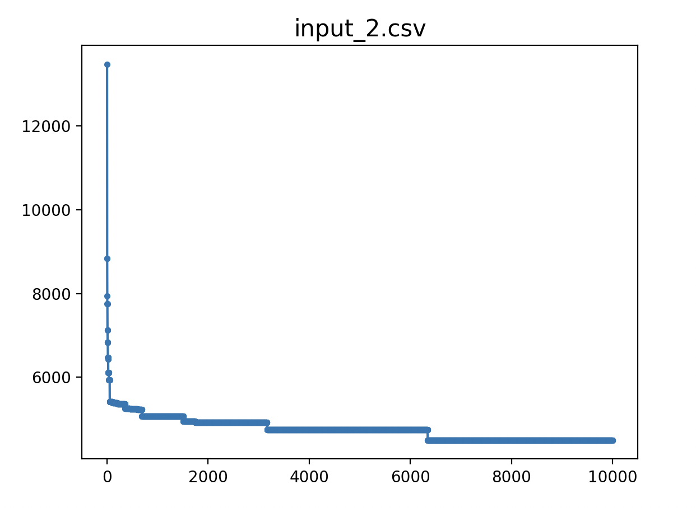

# week5

学校の授業で遺伝的アルゴリズムはNP困難問題に対して有効と聞いたので実装してみた。

## 遺伝的アルゴリズム

#### 実装

序盤のinput_0.csv,input_1.csv,input_2.csvまでは最小経路（sample/saの値）を導き出せた。その後のinputファイルは実行時間が相当かかったため最小経路まで辿り着くには実行回数が想定以上に必要だと思われた。
最小経路に辿り着くにはPCのスペック的に厳しそうと思われる。

適応度はルートの総距離。エリート選択（適応度が高い個体を残す選択）で行った。
下記のグラフの通り、実行の最初は世代が変わるにつれて優秀な個体が生まれたが、中盤になってくるとあまり変化が見られなくなっていった。エリート選択では多様性が下がり局所解に陥ったと思われる。

input_6.tsxはおそらく６時間くらいかかって結果が出力されたが、凡ミスにより保存できなかった、、、

####　対応策

1.ルーレット選択（適応度から計算された確率に基づいて選択）もしくはトーナメント選択（個体群からランダムにn個体を取り出して適応度が最も高い個体を選択）を使用すれば良いと思われる。

2.greedyをまず実行してから行えばより早く最短経路を導いだせる可能性が高いと思われる。

